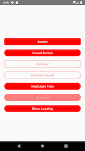
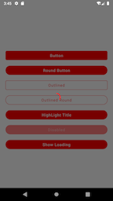

# RNUIStartTemplate

*You're viewing the new and updated version of React Native Starter, previous version can be found under the [v1 branch](https://github.com/flatlogic/react-native-starter/tree/v1)*

A simple react native starter template that bootstraps development of your mobile application.


## What's inside

- React native 0.63 template project
- Modular and well-documented structure for application code
- Redux for state management
- React Navigation for simple switch navigation
- Custom components(Buttons and loading overlay)


## Folder structure
This template follows a very simple project structure:
- `src`: This folder is the main container of all the code inside your application.
  - `assets`: Asset folder to store all images, vectors, etc.
  - `components`: Folder to store any common component that you use through your app (such as a generic button)
  - `constants`: Folder to store any kind of constant that you have.
  - `translations`: Folder to store the languages files.
  - `navigation`: Folder to store the navigators.
  - `screens`: Folder that contains all your application screens/features.
  - `store`: Folder to put all redux middlewares and the store.
	- `reducers`: This folder should have all your reducers, and expose the combined result.
    - `selectors`: Folder to store your selectors for each reducer.
  - `AppStyles.js`: Folder to store all the styling concerns related to the application theme.
  - `App.js`: Main component that starts your whole app.
- `index.js`: Entry point of your application as per React-Native standards.

## Screenshot




## Getting Started

#### Clone and Install

```bash
# Clone the repo
git clone https://github.com/yuriipinchuk/react-native-ui-startkit.git

# Navigate to clonned folder and Install dependencies
cd rn_ui_starter && yarn install

# Install Pods
cd ios && pod install
```

#### Run

Run this command to start the development server and to start your app on iOS simulator:
```
yarn run:ios
```

Or, if you prefer Android:
```
yarn run:android
```
